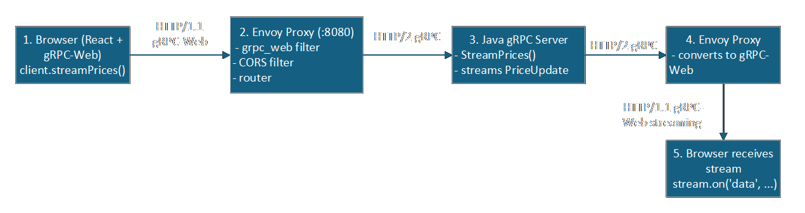

# Stock Price Streaming App

### A simple web application that streams stock prices in real-time using gRPC-java,ReactJS.

## Features

- Real-time stock price updates
- gRPC for efficient communication
- ReactJS for a user interface
- Filtering stocks by name
- Filtering stocks by date
- View stock price history with a graph ChartJs

## Technologies Used

- Backend: gRPC-java
  |Dependency|Purpose|
  |---|---|
  |io.grpc:grpc-netty-shaded|Provides the network transport (HTTP/2) for running gRPC clients/servers.|
  |com.google.protobuf:protobuf-java|Used for serializing/deserializing structured data in a language-neutral way.|
  |io.grpc:grpc-stub|Supplies base classes to make client calls and service implementations.|
  |javax.annotation:javax.annotation-api|Provides annotations for nullability and other metadata.|
  |io.grpc:grpc-protobuf|Enables gRPC to use protobuf for defining service interfaces and messages.|
  |mysql:mysql-connector-java|JDBC driver for MySQL, allowing the application to connect to a MySQL database.|
  |io.github.cdimascio:dotenv-java|Loads environment variables from a `.env` file, useful for configuration management.|
- Frontend: ReactJS
  |Dependency|Purpose|
  |---|---|
  |google-protobuf|Used for serializing/deserializing structured data in a language-neutral way.|
  |grpc-web|Enables gRPC to be used in web applications, allowing communication with gRPC servers.|
  |others|tailwindcss,chartjs|
- Envoy Proxy: A high-performance proxy that can be used to route gRPC requests from the web to the gRPC server.we need this because gRPC-web is not supported by all browsers directly.
  

## Setup Instructions

1. Clone the repository:
2. Assuming you have JDK 11 or higher installed, you can check it by running `java -version` in your terminal. and Node.js installed, you can check it by running `node -v` in your terminal.
3. Download mvn `Binary zip archive` from [here](https://maven.apache.org/download.cgi). -> unzip it and add the `bin` folder to your system PATH.
4. install intellij or any other IDE you can work with.
5. install protobuf compiler `protoc` from [here](https://github.com/protocolbuffers/protobuf/releases). ->Assets -> protoc-32.0-rc-1-win64.zip -> unzip it and add the `bin` folder to your system PATH.
6. install grpc-web compiler `protoc-gen-grpc-web` from [here](https://github.com/grpc/grpc-web/releases/tag/1.5.0). ->Assets -> protoc-gen-grpc-web-1.5.0-windows-x86_64.exe -> rename it to `protoc-gen-grpc-web.exe` and add it to your system PATH.
7. install protoc-gen-js from [here](https://github.com/protocolbuffers/protobuf-javascript/releases) ->Assets -> protoc-gen-js-3.21.12-win64.zip -> unzip it and add the `bin` folder to your system PATH.
8. install Node.js dependencies:
   ```bash
    cd frontend
    npm install
   ```
9. Generate gRPC js files:
   ```bash
   cd frontend
   protoc -I=protos --js_out=import_style=commonjs:./src/grpc --grpc-web_out=import_style=commonjs,mode=grpcwebtext:./src/grpc protos/StockFeed.proto
   ```
10. Generate gRPC java files: Open `stockprice-streaming-grpc` project in your IntelliJ IDE and run the following command in the terminal:
    ```bash
    mvn clean compile
    ```
11. Create a `.env` file in the `stockprice-streaming-grpc` project root directory and add the following environment variables:
    ```bash
    DB_URL=jdbc:mysql://localhost:3306/your_database_name
    DB_USER=your_username
    DB_PASS=your_password
    GRPC_PORT=50051
    ```
12. Start the gRPC server:
    in Intellij IDE, run the `FeedServerDateFilter.java` file in the `stockprice-streaming-grpc` project.
13. Start the Envoy proxy: From the `envoy` directory, run the following command:
    ```bash
    docker run -d --name envoy-grpcweb -p 8080:8080 -p 9901:9901 -v "${PWD}/envoy.yaml:/etc/envoy/envoy.yaml:ro" envoyproxy/envoy:v1.22.0
    ```
14. Start the React app:
    ```bash
    cd frontend
    npm start
    ```
15. Open your web browser and navigate to `http://localhost:3000` to view the application.

### Note:
For More info how these work together, check out the [gRPC-web documentation](https://grpc.io/docs/platforms/web/). Or For this App I will write a blog post about it soon.
    
